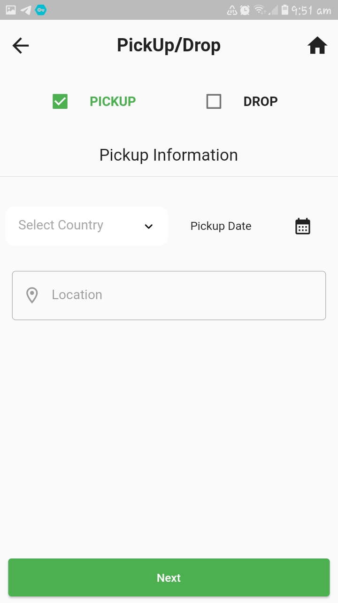
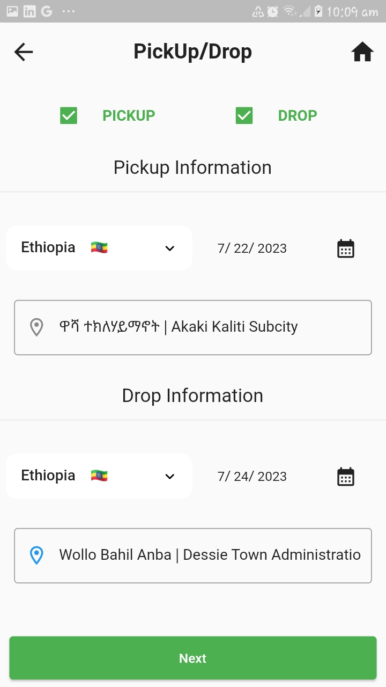

# waliya

A new Flutter project For Summer intern at Zerone.

## Getting Started

### Task 1

Create user-friendly and Minimal page using the provided API.

### Stack Used

- flutter for developing **mobile app** UI.
- shared_prefernces a flutter package to **catching API response** locally.
- provider for **global state-mangement** .
- http for making **API Calls**

Page #1

  
  
Page #2
  Some may have pickup only and others may have drop only

For Countries outside Ethiopia There is no Specific Location

Specific places can be selected in ethiopia

Search Specific Places
 

Selected Values are displayed

Confirm Selection

